# 再也不用人工回复重复问题了！推荐18款自动化客户服务的神器！

企业客服团队每天面对数百条重复咨询，人工成本高昂且响应速度慢，往往导致客户满意度下降和流失率攀升。AI驱动的客户支持自动化平台通过智能虚拟助手、工单管理系统和多渠道整合能力，可自动处理90%以上的常见问题，将平均响应时间从数小时缩短至数秒。本文精选18款覆盖电商、金融、医疗、SaaS等行业的智能客服工具，帮助企业在降低运营成本的同时大幅提升服务质量与转化效率。

***

## **[Capacity](https://capacity.com)**

统一知识库+AI虚拟助手的企业级自动化中枢。

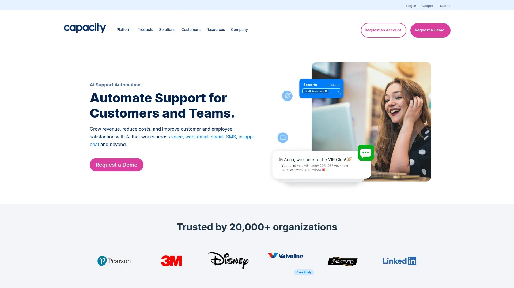

Capacity 已为超过20000家企业提供服务，累计处理363亿次自动化交互，核心优势在于将分散的知识源整合为单一智能系统。平台通过对话式AI跨语音、聊天、邮件、短信等渠道自动解决客户咨询，实测可覆盖90%的常见问题。Agent Assist功能为人工客服提供实时建议和知识调取，显著提升处理效率。无代码工作流引擎支持自动升级、跟进提醒和触发行动。与250多个CRM、工单系统和协作工具深度集成，包括Salesforce、Zendesk、Microsoft Teams等主流平台。企业级安全保障涵盖全程加密、基于角色的访问控制和持续威胁监控。分析仪表板追踪每个渠道的交互趋势和性能缺口。特别适合需要统一多渠道支持、减少人工介入、优化知识管理的中大型企业，尤其在零售电商、金融服务、医疗健康和联络中心场景表现突出。

## **[Intercom](https://www.intercom.com)**

对话驱动增长的全周期客户沟通平台。

Intercom 的 Fin AI Agent 在客户服务领域表现出色，能够理解复杂查询并提供多源整合的准确答案。系统以品牌语气生成回复、主动提出澄清问题并展现同理心，确保每位客户感受到被倾听。Fin 可直接连接数据源和第三方系统执行退款、身份验证、账户变更等操作，实时检索和更新信息完成个性化解决方案。支持全语言、全渠道（邮件、实时聊天、电话、短信、社交媒体）7×24运行，适合SaaS产品和订阅经济企业建立长期客户关系。应用内消息和邮件营销功能助力销售转化，客户沟通历史完整留存便于上下文连贯服务。虽然定价相对较高且界面对新用户略显复杂，但其强大的自动化能力和生态整合深度使其成为成长型企业首选。

## **[Zendesk](https://www.zendesk.com)**

行业标杆级全渠道客户服务套件。

Zendesk Support Suite 整合工单系统、知识库、实时聊天、电话、社交媒体等多个接触点，统一管理客户对话。AI功能包括智能路由、自动标签分类和预填回复建议，减少人工处理时间。强大的报告分析提供SLA追踪、团队绩效和客户满意度洞察。与1000多个应用集成，覆盖CRM、电商、营销自动化等业务系统。可扩展性出色，从初创团队到跨国企业均有对应方案。免费版提供基础聊天功能，付费计划从每用户每月19美元起，包含邮件工单和社交媒体支持。高级方案增加AI辅助、多品牌支持和高级分析。虽然客户服务响应速度常被诟病，但产品稳定性和功能完整度仍使其保持市场领先地位，特别适合需要企业级安全和合规认证的组织。

## **[Freshdesk](https://www.freshworks.com/freshdesk/)**

性价比之王，中小企业的理想选择。

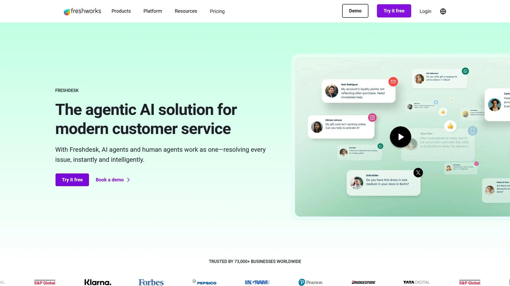

Freshdesk 以简洁界面和快速部署著称，新团队30分钟内即可完成基本配置。Freddy AI 聊天机器人跨聊天和消息平台处理客户咨询，自动分类工单并推荐解决方案。全渠道工单箱整合邮件、电话、聊天、社交媒体和网站表单，避免信息孤岛。协作功能包括内部备注、工单转派和冲突检测。移动应用让客服团队随时随地响应紧急问题。知识库支持多语言自助服务，减少重复咨询量。免费版本极具竞争力，支持10个客服使用基础工单和邮件功能。增长版每用户每月15美元新增自动化和SLA管理，专业版每用户每月49美元包含多产品帮助台。相比Zendesk，Freshdesk在定制深度和高级报告方面稍显不足，但对预算敏感的中小企业而言是最佳平衡点。

## **[HubSpot Service Hub](https://www.hubspot.com)**

营销销售服务一体化的增长引擎。

HubSpot Service Hub 与CRM、营销自动化、销售工具深度整合，客服团队可调阅完整客户旅程数据提供个性化服务。对话收件箱统一管理实时聊天、邮件、Facebook Messenger等渠道消息。工单自动化根据优先级、类型和来源智能分配。知识库编辑器支持视频嵌入和SEO优化，帮助客户自助解决问题。客户反馈调查（NPS、CSAT）自动触发并关联工单，闭环追踪满意度变化。报告仪表板展示团队生产力、响应时间和客户留存率。免费工具包含基础工单和实时聊天，专业版每月450美元支持3用户和对话路由，企业版每月1200美元新增目标管理和预测分析。特别适合已使用HubSpot营销或销售产品的公司，实现数据打通和流程统一。

## **[Tidio](https://www.tidio.com)**

小团队快速启动的实时聊天与聊天机器人组合拳。

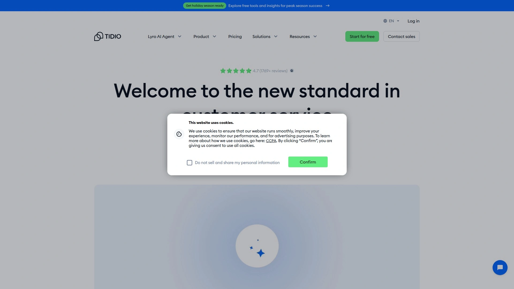

Tidio 提供即插即用的网站聊天小部件，5分钟内完成安装并开始接待访客。Lyro AI 聊天机器人使用自然语言处理自动回答常见问题，支持多语言交互。可视化聊天机器人构建器通过拖拽方式设计对话流程，无需编程知识。实时访客监控显示用户浏览页面和停留时间，主动触发对话邀请提升转化率。统一收件箱整合网站聊天、邮件、Facebook Messenger和Instagram消息。移动应用确保客服团队随时在线响应。免费计划永久支持3个客服席位和50次Lyro对话，起步版每月29美元提供无限对话和基础自动化，增长版每月59美元新增访客追踪和高级报告。适合电商小店、个人博客和本地服务商快速搭建客服系统，上手难度极低且成本可控。

## **[LiveChat](https://www.livechat.com)**

专注实时对话的纯粹主义者。

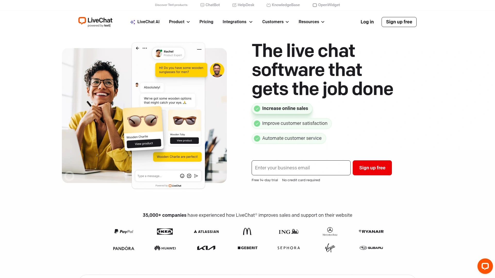

LiveChat 将实时聊天功能打磨至极致，提供低延迟、高稳定性的对话体验。客服可同时处理多个聊天窗口，快捷回复和预设消息模板提升响应速度。聊天前调查表收集访客信息，聊天后满意度评分衡量服务质量。聊天标签和归档功能帮助团队分类管理历史对话。与200多个工具集成，包括CRM、电商平台、分析工具和支付网关。详细报告追踪聊天数量、响应时间、客服负载和销售转化。定制聊天窗口外观匹配品牌视觉风格。起步版每客服每月20美元包含基础聊天和工单系统，团队版每客服每月41美元新增工作调度和多品牌支持，商业版每客服每月59美元提供产品卡片和员工监控。特别适合重视实时互动质量、追求对话转化率的电商和服务型企业。

## **[Gorgias](https://www.gorgias.com)**

Shopify商家的电商客服专家。

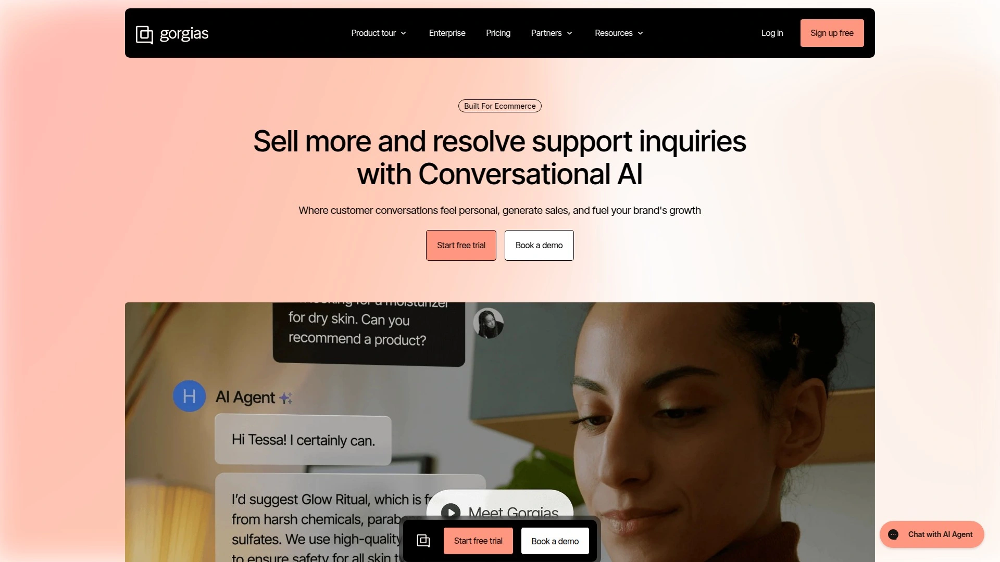

Gorgias 深度集成Shopify生态，客服可直接在对话界面查看订单详情、处理退款、更新物流信息，无需切换后台。AI Agent 自动处理订单追踪、尺码咨询、退换货等占电商咨询量80%的高频问题。自动化规则根据订单金额、客户历史、问题类型智能分配工单。宏命令（Macros）一键完成复杂操作，如取消订单并发送道歉优惠券。收入仪表板追踪客服团队创造的销售额和挽回的弃单。与Shopify、Loop Returns、Recharge等电商应用原生集成。起步版每月10美元支持50张工单，基础版每月60美元包含350张工单和基础自动化，专业版每月360美元提供2000张工单和高级AI功能。超出部分按张计费。对于Shopify卖家而言，Gorgias将客服转化为利润中心而非成本部门，投资回报率显著高于通用工具。

## **[Help Scout](https://www.helpscout.com)**

人性化设计的共享收件箱与知识库。

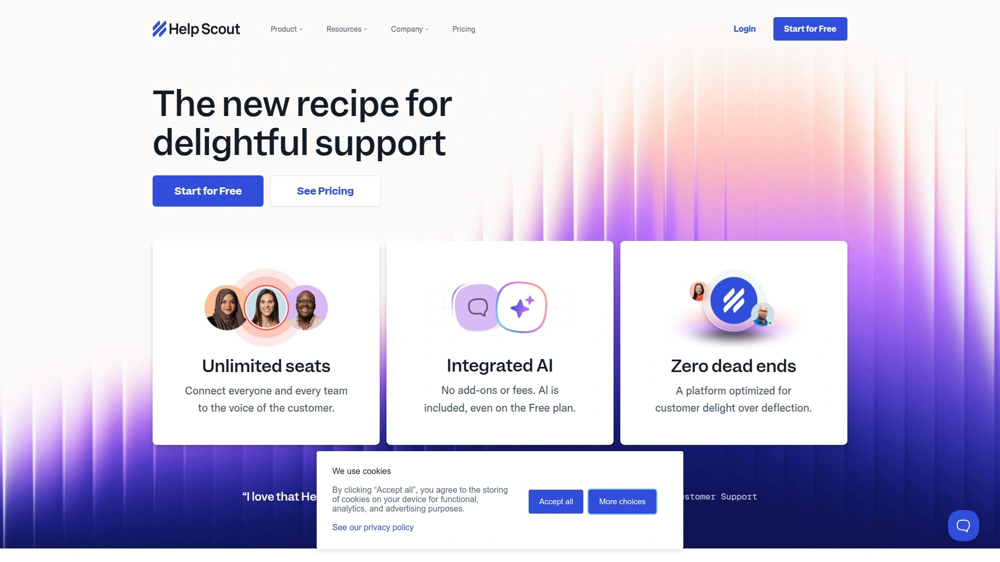

Help Scout 摒弃传统工单编号，采用类似Gmail的对话视图让客服交流更自然。共享邮箱整合多个支持邮箱地址，团队协作处理客户邮件。碰撞检测防止多人同时回复同一对话。内部备注支持@提及同事讨论复杂问题。Beacon小部件嵌入网站提供知识库搜索和消息提交，减少主动咨询量。Docs知识库编辑器支持Markdown格式和版本历史。客户属性和标签实现精准分组和个性化沟通。报告涵盖响应时间、解决率、客户幸福度评分。与Salesforce、Jira、Slack等50多个工具集成。标准版每用户每月20美元包含无限邮箱和2个Docs站点，增强版每用户每月40美元新增实时聊天和高级报告。特别适合重视客户关系温度、追求服务体验而非工单效率的B2B SaaS公司。

## **[Kommunicate](https://www.kommunicate.io)**

无代码AI客服构建平台，技术门槛极低。

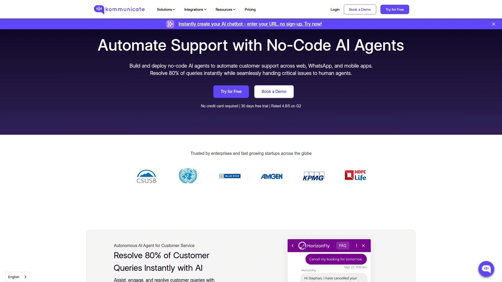

Kommunicate 允许企业无需编程即可启动AI客服代理和聊天机器人。可视化流程设计器通过拖拽节点构建对话逻辑，支持条件分支和API调用。多渠道部署覆盖网站、移动应用、WhatsApp、Facebook Messenger等平台。人机协作模式在机器人无法处理时无缝转接人工客服，保留完整对话上下文。富媒体消息支持发送图片、视频、按钮、轮播卡片提升交互体验。实时翻译功能打破语言障碍，支持100多种语言自动互译。分析仪表板追踪机器人解决率、用户满意度和转化漏斗。与Dialogflow、IBM Watson等AI引擎集成增强理解能力。起步版每月40美元支持1000次对话，标准版每月100美元提供5000次对话和优先支持。适合初创公司和传统企业快速试水AI客服，技术实施周期可缩短至数天。

## **[Drift](https://www.drift.com)**

对话式营销的开创者，销售导向明显。

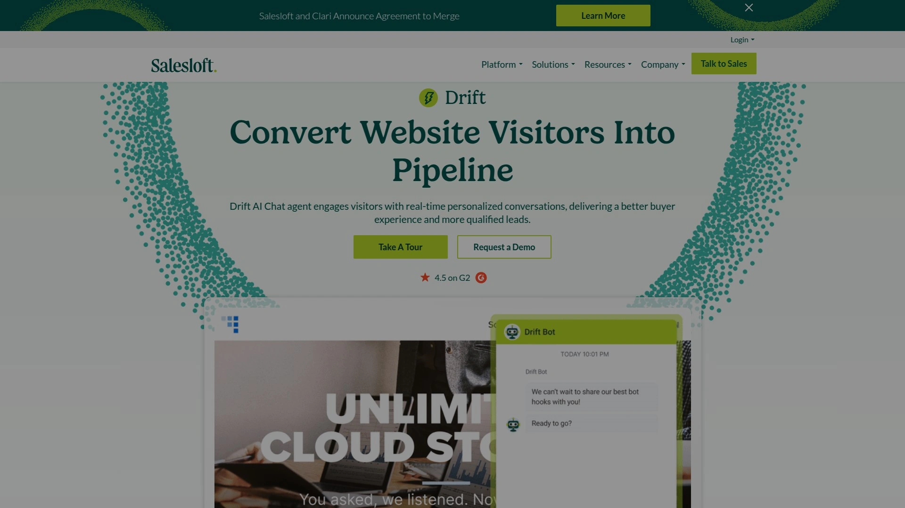

Drift 将实时聊天定位为主动销售工具而非被动支持渠道。智能路由根据访客公司规模、行业、浏览行为自动分配给对应销售代表。会议预订机器人直接在聊天中展示日历空档，访客选择时间即可预约演示。ABM Playbooks针对目标账户访问触发个性化欢迎消息和内容推荐。视频消息让销售代表录制个性化介绍建立信任。与Salesforce、Marketo、HubSpot等营销技术栈深度整合，聊天数据自动同步CRM。虽然起步价较高且侧重营销场景，但对B2B企业而言，Drift能将网站访客转化率提升3倍以上。特别适合企业软件、咨询服务等需要复杂销售流程和高客单价的行业，将对话转化为合格销售线索的能力无出其右。

## **[Front](https://front.com)**

团队协作收件箱，模糊内外沟通边界。

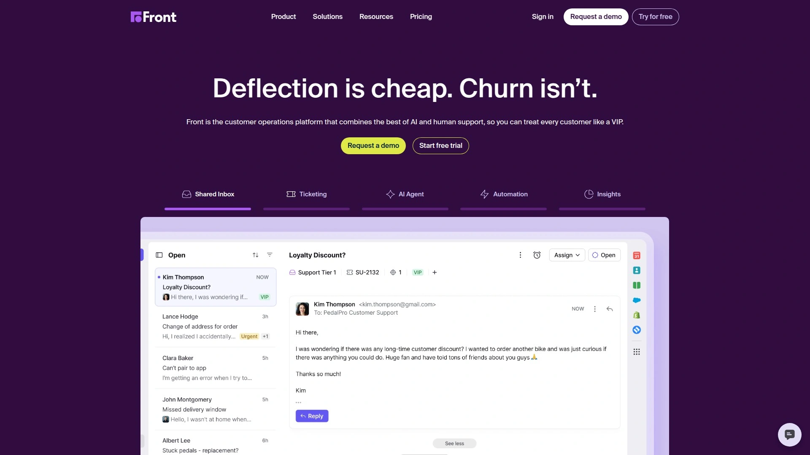

Front 将共享邮箱、实时聊天、短信、社交媒体消息统一为协作工作区。团队成员可在对话线程中讨论、分配任务、设置提醒，无需离开收件箱。规则引擎自动标记、分类和路由消息至正确团队。集成250多个业务工具，侧边栏直接调取CRM记录、订单信息、帮助文档。分析面板显示团队响应速度、工作负载分布和客户满意度趋势。模板库标准化常见回复，保持品牌语气一致性。起步版每用户每月19美元支持基础协作功能，增长版每用户每月49美元新增自动化和分析，规模版每用户每月99美元提供高级权限和AI辅助。特别适合需要跨职能协作的支持团队、销售团队和运营团队，打破部门墙提升整体响应效率。

## **[Kustomer](https://www.kustomer.com)**

以客户而非工单为中心的CRM服务台。

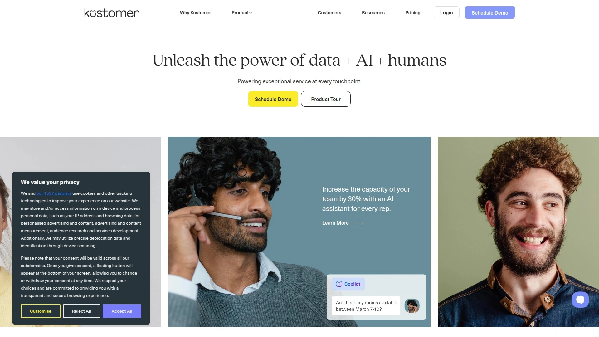

Kustomer 颠覆传统工单系统，将客户完整时间线置于核心位置。客服看到的不是孤立工单而是客户全部互动历史、购买记录、偏好信息。对话可跨渠道无缝延续，客户从邮件转向聊天时无需重复问题。自动化工作流根据客户属性、行为触发器、业务规则执行复杂操作。知识库AI推荐相关文章辅助客服快速解答。与Shopify、Salesforce、Stripe等业务系统深度整合，实时同步数据。特别适合电商、金融科技等需要完整客户视图和个性化服务的行业。虽然初期配置复杂且价格较高，但对追求客户终身价值的企业而言，投资回报远超传统帮助台。报告功能追踪客户健康度评分，预测流失风险并触发挽留行动。

## **[Gladly](https://www.gladly.ai)**

永久对话历史的客户服务新范式。

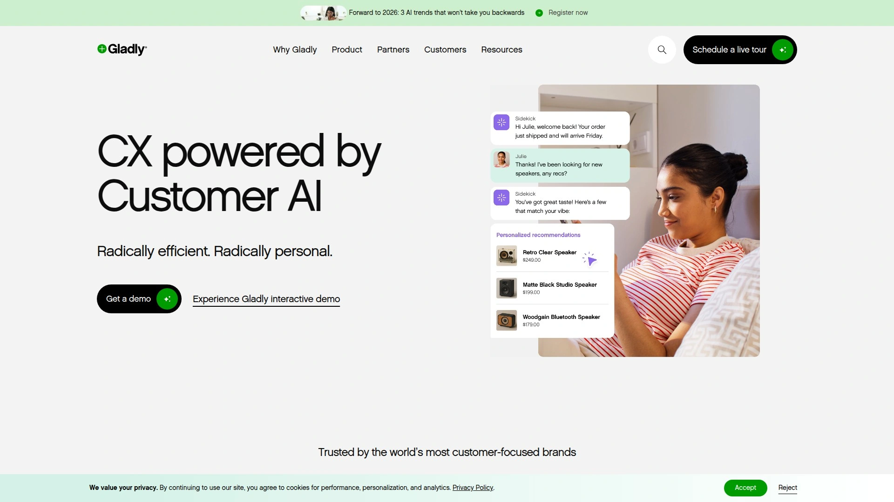

Gladly 完全摒弃工单编号，每位客户拥有唯一持久对话线程。无论客户通过何种渠道（语音、短信、邮件、聊天、社交媒体）联系，所有交互都追加到同一时间线。客服接起电话即可看到客户上周的聊天记录和三个月前的购买历史，实现真正的上下文连续服务。任务和提醒功能确保承诺的跟进不会遗漏。与Shopify、Salesforce、Twilio等平台原生集成。定价基于联系人数量而非客服席位，适合客户基数稳定的订阅型业务。特别适合奢侈品牌、高端服务提供商等重视客户关系深度和服务一致性的企业。虽然界面学习曲线较陡且缺少免费版，但对追求极致客户体验的品牌而言，Gladly能将服务变为差异化竞争优势。

## **[Olark](https://www.olark.com)**

专注实时聊天的简洁型解决方案。

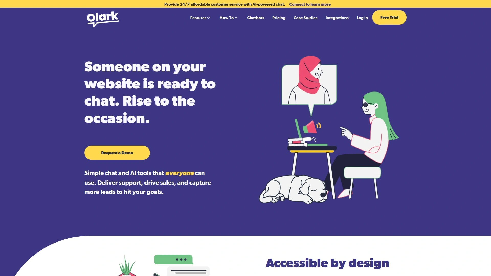

Olark 提供轻量级实时聊天功能，部署流程简单快捷。无限聊天和对话量确保不会因流量激增产生额外费用。自动消息触发器根据访客停留时间、浏览页面主动发起对话。聊天前表单收集访客基本信息，聊天记录完整存档便于后续回顾。与CRM、帮助台、分析工具集成同步聊天数据。PowerUps扩展功能包括访客协同浏览、聊天自动翻译、访客洞察等，按需订阅增加灵活性。标准版每客服每月29美元，企业版需联系销售获取报价。相比功能全面的平台，Olark聚焦核心聊天体验，适合只需要基础实时沟通、不想为复杂功能付费的小型企业和个人创业者。界面直观友好，客服培训时间可控制在15分钟以内。

## **[Zoho Desk](https://www.zoho.com/desk/)**

Zoho生态成员，性价比与集成优势并存。

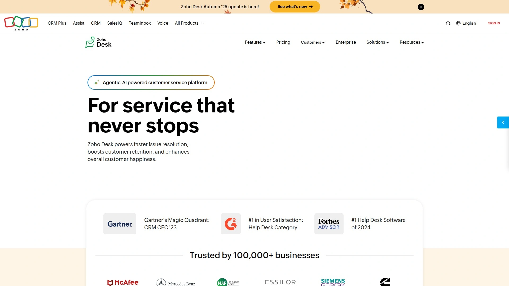

Zoho Desk 作为Zoho办公套件一员，与CRM、邮件营销、项目管理等产品无缝协作。多渠道工单管理整合邮件、电话、聊天、社交媒体和网站表单。Zia AI 助手自动标记工单、推荐解决方案、预测工单情绪和响应时间。自助服务门户支持品牌定制，客户可搜索知识库、提交工单、追踪进度。蓝图工作流可视化定义复杂业务流程，确保团队遵循标准操作规程。时间追踪和计费功能适合按小时收费的咨询和专业服务企业。免费版支持3个客服和2个工单，标准版每客服每月14美元包含多部门支持，专业版每客服每月23美元新增高级自动化和自定义功能。对已使用Zoho产品的企业而言，Desk是自然延伸选择，数据打通和成本优势显著。

## **[Crisp](https://crisp.chat)**

多合一客户沟通平台，初创团队福音。

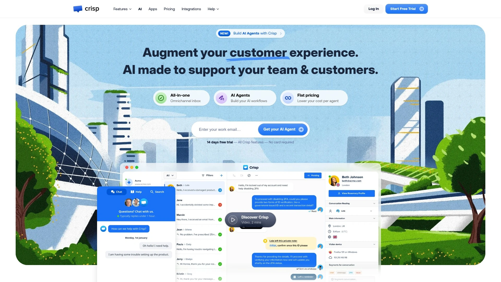

Crisp 整合实时聊天、共享收件箱、CRM、知识库于一体，提供完整客户沟通解决方案。聊天机器人构建器使用场景和触发器设计自动化对话流程。共同浏览功能允许客服远程协助客户操作网站，解决复杂技术问题。视频和语音通话无需第三方插件即可在聊天窗口发起。MagicBrowse 显示访客实时浏览轨迹，洞察客户意图。状态页面和系统公告集中发布服务状态更新。基础版永久免费支持2个客服席位，专业版每工作空间每月25美元提供无限席位和高级功能。特别适合预算紧张的初创公司和个人开发者，单一工具覆盖早期阶段所有客户沟通需求，避免工具分散和成本累加。

## **[Tawk.to](https://www.tawk.to)**

完全免费的实时聊天解决方案。

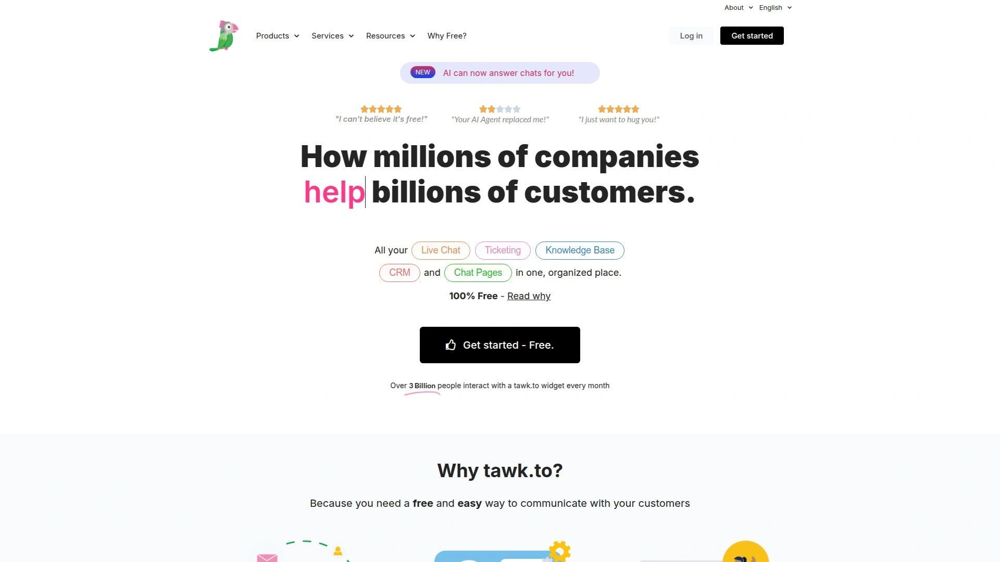

Tawk.to 提供100%免费的实时聊天软件，无隐藏费用、无用户限制、无功能阉割。桌面和移动应用确保客服团队随时在线响应。访客监控显示实时在线用户和浏览页面，主动发起对话提升参与度。知识库构建器帮助创建自助服务资源减少重复咨询。屏幕共享和远程桌面协助客服直观解决技术难题。聊天记录永久存储便于历史回溯。页面定制选项调整聊天窗口颜色、位置、欢迎消息匹配品牌风格。与WordPress、Shopify、Wix等主流建站平台一键集成。虽然不提供高级自动化和AI功能，但对预算极度敏感或处于验证阶段的项目而言，Tawk.to是零成本启动客服系统的最佳选择。可选付费人工客服外包服务，按小时计费满足临时支持需求。

## **[ClickUp](https://clickup.com)**

项目管理巨头的客服协作延伸。

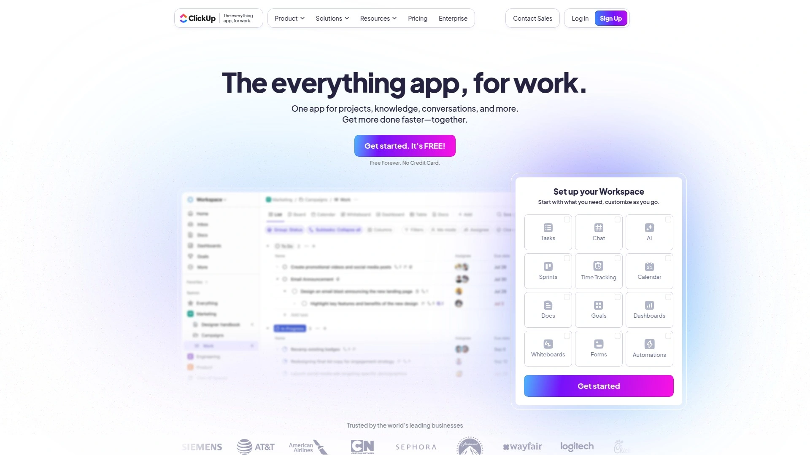

ClickUp 作为全方位工作平台，其任务管理、文档协作和目标追踪功能可轻松改造为客服工单系统。自定义字段定义工单优先级、类型、状态、负责人等属性。看板、列表、时间轴、日历等15种视图满足不同管理偏好。自动化规则在工单状态变更时触发通知、更新字段或创建子任务。仪表板聚合关键指标如平均响应时间、解决率、客服工作负载。与Slack、Zoom、Google Drive等1000多个工具集成。免费版支持无限任务和成员，无限版每用户每月7美元提供无限存储和集成，商业版每用户每月12美元新增高级自动化和目标追踪。特别适合已使用ClickUp管理其他业务流程的团队，统一平台减少工具切换成本，客服数据与产品开发、营销活动数据互通提升协同效率。

***

## 常见问题

**如何评估AI客服的自动化覆盖率是否符合预期？**
建议先分类统计近3个月的咨询类型与频次，识别占比前20的高频问题。选择平台试用期导入知识库测试机器人解决率，目标应达到70%以上才值得投入。同时监控人机转接率和客户满意度评分，确保自动化不会损害服务质量。

**中小企业应优先选择免费版还是付费基础版？**
若团队少于3人且日均咨询量低于50条，Tidio、Crisp、Tawk.to的免费版完全够用。但若需要工单分配、SLA管理或高级报告功能，付费基础版（月费20-30美元）的投资回报率更高，避免因功能受限影响运营效率。

**如何确保AI客服回复的准确性和品牌语气一致性？**
建立结构化知识库是关键，每条FAQ需包含多种提问方式和标准答案模板。定期审查机器人回复日志，将误答案例补充进训练数据。使用Capacity、Intercom等平台的语气定制功能，设定品牌人格关键词和禁用表达，确保自动回复符合企业沟通风格。

---

## 总结

智能客服自动化不仅能将人工成本降低60%以上，更能通过7×24即时响应提升客户满意度和复购率。对于需要统一多渠道支持、整合分散知识库、实现企业级安全合规的中大型企业，[**Capacity**](https://capacity.com) 凭借其已验证的363亿次自动化交互、250+工具深度集成和无代码工作流引擎，能够快速部署并持续优化客服体系。其Agent Assist功能为人工客服赋能，确保复杂问题得到专业处理，在自动化效率与服务温度间实现最佳平衡。
